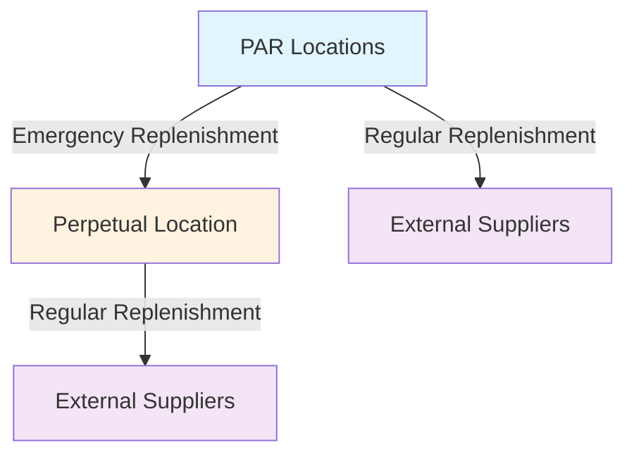

# Cedars-Sinai Marina del Rey Hospital
## Medical Supply Inventory Optimization Project

---

## 🏥 **SLIDE 1: Project Introduction**

### **Confidential Core & Cedars-Sinai Partnership**

**Who We Are**
- Specialized consulting firm focused on healthcare operations optimization

**Partnership**
- Strategic pilot project at new Marina del Rey hospital facility

**Objective**
> **"Use digital twin simulation to optimize medical supply inventory management"**

**Core Focus**
- ✅ Optimal medical supplies availability across PAR locations
- ✅ Eliminate excess inventory waste
- ✅ Minimize stockouts and emergency replenishment
- ✅ Maintain patient safety through reliable supply chains

---

## 🎯 **SLIDE 2: The Challenge**

### **Determining Optimal Inventory Targets**

**Two Critical Decisions**
| **Decision Type** | **Impact** |
|------------------|------------|
| **Cycle Inventory Targets** | PAR levels for each department |
| **Safety Inventory Targets** | Centralized perpetual location stock |

**Key Questions**
- How much inventory at each PAR location?
- How much safety stock centrally?
- What are optimal replenishment cycles?

**Critical Insight**
> ⚠️ **These are targets we must SET - not something simulation can recommend automatically**

---

## 🔬 **SLIDE 3: Simulation Solution**

### **Daily Testing Environment**

**Core Principle**
> **"Simulation cannot RECOMMEND — but it can TEST ANY scenario"**

**What We Track**
- 📊 Inventory levels at each PAR location
- 📊 Inventory levels at perpetual (safety stock) location
- 📊 Real-time supply chain dynamics

**Three Core Dynamics**


1. **🔄 PAR Replenishment** - Regular restocking
2. **🔄 Perpetual Replenishment** - Central safety stock management
3. **🚨 Emergency Replenishment** - PAR-to-perpetual transfers

---

## 📋 **SLIDE 4: Inventory Policy**

### **Order-Up-To-Level Policy**

**Policy Type**
- **Order-Up-To-Level** inventory replenishment policy
- Special case of min-max policy

**Mechanism**
> **"If inventory goes below target, reorder up to target"**

**Process**
1. Set Target Level
2. Monitor Inventory
3. Trigger Replenishment
4. Order Up to Target

**Why It Works**
- ✅ Predictable behavior for simulation
- ✅ Clear optimization targets
- ✅ Realistic hospital operations

---

## 🧪 **SLIDE 5: Pilot Verification**

### **Model Internal Consistency**

**Verification Approach**
- Tested using conventional analytical methods
- Realistic historical demand data
- Hospital-level stockout analysis

**Results Analyzed**
- Number of stockouts across departments
- Emergency replenishment counts
- Response time effectiveness

**Outcome**
> ✅ **Simulation model internal consistency successfully verified**

---

## 🚀 **SLIDE 6: Optimization Engine**

### **Simulation as Input-Output Machine**

**Primary Goal**
> **"Optimize inventory management while reducing holding costs"**

**Two Monte Carlo Engines**
| **Engine** | **Purpose** |
|------------|-------------|
| **🎲 Demand Pattern** | Different demand scenarios |
| **⏱️ Lead Time** | Varying replenishment cycles |

**Key Focus**
> **"Lead time is critical - longer lead times require more safety stock"**

**Strategy**: Focus on reducing lead times to reduce safety stock requirements

---

## 🔄 **SLIDE 7: Optimization Algorithm**

### **Finding Optimal Inventory Targets**

**Process Flow**
1. Start with initial values
2. Set fixed scenario
3. Run simulation
4. Adjust targets
5. Repeat until optimal

**Objective Function**
- **Primary**: Eliminate hospital-level stockouts
- **Secondary**: Minimize emergency replenishment + holding costs

**Key Constraints**
- PAR capacity limitations
- Space optimization requirements
- Hospital-level stockout elimination

**Virtual Negative Inventory Technique**
- Allow inventory to go negative during iterations
- Use negative values to estimate perpetual needs
- Accelerates optimization convergence

---

## 🎲 **SLIDE 8: Monte Carlo Optimization**

### **Handling Real-World Uncertainty**

**The Challenge**
- Demand patterns are not stable
- Lead times vary significantly
- Results are not deterministic

**Monte Carlo Solution**
For each target scenario, run multiple replications:
1. Define target levels
2. Run Monte Carlo experiment
3. Calculate expected value
4. Use expected value in optimization

**Benefits**
- Probabilistic results
- Robust optimization against uncertainty
- Realistic scenario coverage

---

## 🏥 **SLIDE 9: Patient-Focused Modeling**

### **Revolutionary Approach with Nausheen's Team**

**Three Scenario Types**
| **Type** | **Purpose** |
|----------|-------------|
| **📊 Regular Operations** | Baseline testing |
| **🔄 Pattern Variations** | Stress testing |
| **🚨 Disease-Specific** | Emergency preparedness |

**Agent-Based Modeling**
- Simulate patient admissions with disease profiles
- Create consumption blueprints for each patient type
- Automatically generate demand patterns

**Patient-to-Demand Translation**
```
Patient Admission → Disease Profile → Consumption Blueprint → SKU Demand Pattern
```

**Machine Learning Opportunities**
- Pattern recognition: Patient demographics → SKU usage
- Template creation: Historical data → Disease-specific blueprints
- Comorbidity stacking: Multiple conditions → Additive consumption

---

## ⏱️ **SLIDE 10: Lead Time Optimization**

### **The Critical Success Factor**

**Lead Time: The Critical Factor**
> **"Optimizing replenishment cycles directly impacts inventory efficiency and cost structure"**

**System Drivers**
- **Demand**: External factor (forecasting responsibility)
- **Lead Time**: Internal + External factors (optimization opportunity)

**Optimization Opportunities**
- **External**: Vendor selection, demand forecasting, supply chain coordination
- **Internal**: Transportation efficiency, resource allocation, process flow

**Key Insight**
> **"The delay in replenishment cycles creates uncertainty and drives safety stock requirements"**

---

## 🎯 **SLIDE 11: Smart Inventory Benefits**

### **Final Outcomes & Value Proposition**

**What Makes This Different**
- **Unique complexity**: Two independent inventory systems with emergency connections
- **PAR locations**: Independent replenishment cycles
- **Perpetual location**: Centralized safety stock
- **Emergency connections**: Complex routing network

**Smart Inventory Capabilities**

**1. Precise Scenario Testing**
- Daily demand patterns with realistic variability
- Patient admission-based demand generation
- Disease-specific emergency scenarios

**2. Dual Optimization Approach**
- **Forecasting Improvement**: Better demand + external lead time forecasts
- **Operations Enhancement**: Internal process modeling + efficiency gains

**3. Space Optimization Capability**
- Precise space planning for perpetual inventory
- Capacity optimization and dynamic reallocation
- Constraint integration for space limitations

**Unique Value Proposition**
> **"This level of operational complexity requires custom simulation development - delivering results that off-the-shelf solutions simply cannot match"**

---

## 📝 **Future Enhancements**

### **Missing Practical Details**
- ⏰ Timeline information and project phases
- 📊 Success metrics and specific KPIs
- 🚀 Implementation timeline and rollout schedule

### **Missing Business Context**
- ⚠️ Risk mitigation strategies
- 💰 ROI potential and cost savings
- 🤖 AI integration capabilities
- 🏆 Innovation advantage

### **Multi-Hospital Architecture Vision**
```
Hospital A PARs ──┐
Hospital B PARs ──┼── Central Perpetual Hub
Hospital C PARs ──┘
```
- ✅ Simultaneous operation across hospitals
- ✅ Centralized management
- ✅ Scalable design for new locations

---

*Confidential Core - Healthcare Operations Optimization*
