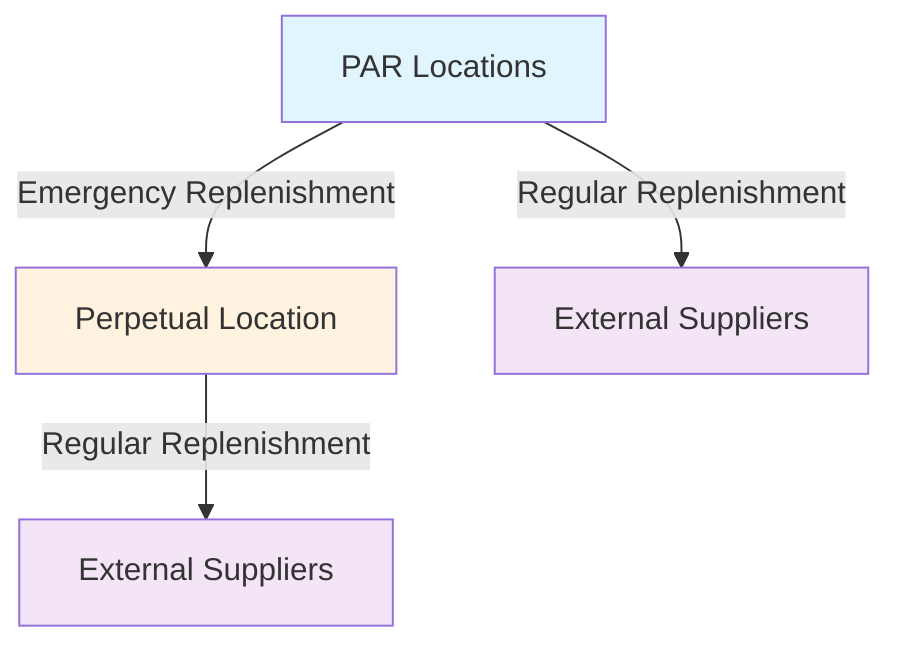

# Cedars-Sinai Marina del Rey Hospital
## Medical Supply Inventory Optimization Project

---

## 🏥 **SLIDE 1: Introduction & Background**

### **Title: Introducing Confidential Core & the Simulation Challenge**

---

### **Who We Are**
**Confidential Core** is a specialized consulting and simulation engineering firm focused on healthcare operations optimization.

### **Our Partnership**
We have partnered with **Cedars-Sinai Health System** for a strategic pilot project at their new **Marina del Rey hospital facility**.

### **Project Objective**
> **"Use digital twin simulation to optimize medical supply inventory management"**

### **Core Focus Areas**
- ✅ Ensuring optimal medical supplies availability across all PAR locations
- ✅ Eliminating excess inventory waste
- ✅ Minimizing stockouts and emergency replenishment needs
- ✅ Maintaining patient safety through reliable supply chains

---

## 🎯 **SLIDE 2: Problem Statement**

### **Title: The Challenge - Optimizing Hospital Inventory**

---

### **The Core Problem**
Cedars-Sinai needs to determine optimal inventory levels for their new Marina del Rey hospital:

### **Two Critical Decisions Required**

| **Decision Type** | **What It Means** | **Impact** |
|------------------|-------------------|------------|
| **Cycle Inventory Targets** | PAR levels for each department | Daily operational efficiency |
| **Safety Inventory Targets** | Centralized perpetual location stock | Emergency backup availability |

### **Key Questions We Must Answer**
- 🏥 **How much inventory** should be kept at each PAR location?
- 🏥 **How much safety stock** should be held centrally?
- 🏥 **What are the optimal replenishment cycles?**

### **Critical Insight**
> ⚠️ **These are targets we must SET - not something simulation can recommend automatically**

---

## 🔬 **SLIDE 3: Simulation Overview**

### **Title: Simulation as a Testing Environment**

---

### **Core Principle**
> **"Simulation on its own cannot RECOMMEND — but it can TEST ANY scenario"**

### **What Our Simulation Tracks**
The model provides **time-series behavior analysis** of:

- 📊 **Inventory levels at each PAR location**
- 📊 **Inventory levels at the perpetual (safety stock) location**
- 📊 **Real-time supply chain dynamics**

### **Three Core Dynamics Modeled**



1. **🔄 PAR Replenishment** - Regular restocking of department locations
2. **🔄 Perpetual Replenishment** - Central safety stock management
3. **🚨 Emergency Replenishment** - PAR-to-perpetual emergency transfers

### **Technical Specifications**
- **Daily simulation capability** - Unique ability to process daily demand patterns and produce daily inventory trajectories
- **SKU-level lead times** modeled for both PAR and perpetual replenishment
- **Real-time inventory tracking** across all locations
- **Demand pattern analysis** and impact assessment

### **Simulation Outputs**
- 📈 **Inventory trajectories** (time series data)
- 📊 **Emergency replenishment counts** and magnitude
- ⚠️ **Full stockout incidents** (even after drawing from perpetual)

---

## 🧪 **SLIDE 4: Pilot Phase - Inventory Testing**

### **Title: Pilot - Testing Estimation Methods**

---

### **Pilot Approach**
We tested our simulation using **two conventional analytical methods** for inventory target calculation:

| **Method** | **Application** | **Purpose** |
|------------|----------------|-------------|
| **Safety Stock Formula** | Cycle inventory (PAR levels) | Standard industry approach |
| **Safety Stock Formula** | Safety inventory (perpetual) | Central backup optimization |

### **Testing Framework**
- 📊 **Realistic historical demand data** used for validation
- 🏥 **Hospital-level stockout analysis** performed
- ⚡ **Emergency replenishment tracking** implemented

### **Pilot Results Analyzed**
- 📈 **Number of stockouts** across hospital departments
- 🔄 **Emergency replenishment counts** and severity levels
- ⏱️ **Response time effectiveness** of current systems

### **Validation Outcome**
> ✅ **Simulation engine successfully validated** for real-world healthcare inventory scenarios

### **Next Steps**
> 📋 **Detailed pilot scenario results available in separate technical deck**

---

## 🚀 **SLIDE 5: Expansion Phase - Optimization Engine**

### **Title: Expansion - Using the Simulation as an Optimization Engine**

---

### **Primary Goal**
> **"Optimize and enhance inventory management while reducing inventory holding costs"**

### **Simulation as Input-Output Machine**
The simulation functions as a **daily simulation engine** that:
- **Input**: Daily demand patterns
- **Output**: Inventory levels over time
- **Capability**: Processes daily demand and produces daily inventory trajectories

### **Two Monte Carlo Engines**
The simulation contains **two independent randomness sources**:

| **Engine** | **Purpose** | **Impact** |
|------------|-------------|------------|
| **🎲 Demand Pattern Engine** | Generates different demand scenarios | Affects inventory depletion rates |
| **⏱️ Lead Time Engine** | Simulates varying replenishment cycles | Determines safety stock requirements |

### **Lead Time Optimization Focus**
> **"Lead time is the key factor - longer lead times require more safety stock"**

**Optimization Strategy**: Focus on **reducing lead times** to naturally reduce safety stock requirements

### **Simulation Capabilities**
The simulation now allows us to test **any scenario** by varying three key parameters:

| **Parameter** | **Description** | **Impact** |
|---------------|-----------------|------------|
| **🎯 Inventory Targets** | Cycle and safety stock levels | Supply availability |
| **⏱️ Lead Times** | PAR and perpetual replenishment cycles | Response speed |
| **📊 Demand Patterns** | Daily time series variations | Real-world complexity |

### **Advanced Dynamics Captured**

#### **Demand Pattern Complexity**
> **"Sequential or lumpy demands can deplete inventory faster than averages suggest"**

- 🔄 **Signal-like demand patterns** that create dynamic inventory depletion
- ⚡ **Rapid succession demands** vs. **spaced-out demands**
- 📈 **Real-world variability** that traditional formulas miss

### **Visual System Architecture - Three Loops**

```
┌─────────────────────────────────────┐
│        PAR REPLENISHMENT CYCLE      │
│         [Lead Time Inside]          │
│  ←─── Demand Signals Input ────     │
└─────────────────┬───────────────────┘
                  │
                  │ Emergency
                  │ Replenishment
                  │ (Vertical Loop)
                  ▼
┌─────────────────────────────────────┐
│      PERPETUAL REPLENISHMENT CYCLE  │
│         [Lead Time Inside]          │
└─────────────────────────────────────┘
```

### **Three Cycle Explanation**
1. **🔄 Top Loop**: PAR replenishment cycle with lead time delays
2. **🔄 Bottom Loop**: Perpetual replenishment cycle with lead time delays  
3. **🔄 Vertical Loop**: Emergency replenishment connecting PAR to perpetual

### **Scenario Testing Outputs**
For each scenario tested, we receive:

- 📊 **Time-series inventory levels** (PAR and perpetual)
- 🚨 **Emergency replenishment count** and magnitude
- ⚠️ **Stockout count** and severity
- 📈 **Performance metrics** and optimization insights

### **Implementation Benefits**
- 🎯 **Data-driven inventory decisions**
- 📊 **Risk mitigation** through scenario planning
- 💰 **Cost optimization** through precise targeting
- 🏥 **Patient safety** through reliable supply chains

---

## 📊 **SLIDE 6: Simulation Inputs and Outputs**

### **Title: Understanding Simulation Parameters**

---

### **Simulation Inputs**
| **Input Type** | **Description** | **Responsibility** |
|----------------|-----------------|-------------------|
| **📊 Daily Demand Pattern** | Time series of daily demand | Nausheen's Team |
| **🎯 Target Levels** | PAR and perpetual inventory targets | Optimization Team |
| **⏱️ Lead Times** | PAR and perpetual replenishment cycles | Operations Team |

### **Simulation Outputs**
- 📈 **Inventory level time series** (both PAR and perpetual)
- 🚨 **Number of stockouts** (consequence of inventory levels)
- 🔄 **Number of emergency replenishments** (consequence of inventory levels)

### **Key Insight**
> **"Once you know inventory levels over time, you automatically know the counts of stockouts and emergency replenishments"**

---

## 🔮 **SLIDE 7: Forecasting and Targeted Scenarios**

### **Title: Collaborative Forecasting Approach**

---

### **Nausheen's Team Responsibilities**
**Forecasting demand** using simulation-enhanced methodology:

### **New Forecasting Approach**
Instead of random scenario generation, use **targeted scenario planning**:

1. **📊 Baseline Demand Forecast** - Regular operational patterns
2. **🚨 Specific Emergency Scenarios** - Realistic, targeted situations
3. **🎯 Disease-Specific Planning** - Pandemic and emergency preparedness

### **Concrete Example**
> **"You can safely say we have enough inventory against a pandemic of this type of disease for up to 200 patients for 60 days"**

### **Strategic Benefits**
- ✅ **Targeted preparation** for realistic scenarios
- ✅ **Avoid random scenarios** that may never occur
- ✅ **Specific SKU identification** for emergency cases
- ✅ **Stress testing** hospital capacity against realistic situations

### **Implementation Framework**
- 🔬 **Data Analytics Team**: Identifies meaningful demand patterns
- 🎯 **Simulation Team**: Tests scenarios and optimizes inventory
- 📊 **Collaborative Approach**: Analytics informs simulation inputs

---

## 📋 **Presentation Summary**

### **Key Takeaways**
1. **Problem**: Cedars-Sinai needs optimal inventory targets for new hospital
2. **Solution**: Advanced simulation testing environment
3. **Approach**: Test any scenario with real-world complexity
4. **Value**: Data-driven decisions for inventory optimization
5. **Outcome**: Reduced stockouts, minimized waste, improved patient care

### **Next Steps**
- 🚀 **Expand simulation** to full hospital operations
- 📊 **Implement recommended** inventory targets
- 🔄 **Continuous monitoring** and optimization
- 📈 **Scale approach** to other Cedars-Sinai facilities

---

## 📝 **Future Enhancements & Considerations**

### **Missing Practical Details**
- ⏰ **Timeline information**: Project timeline and phases
- 📊 **Success metrics**: Specific KPIs to be measured
- 🚀 **Implementation timeline**: Rollout schedule

### **Missing Business Context**
- ⚠️ **Risk mitigation**: What happens if inventory isn't optimized?
- 💰 **ROI potential**: Cost savings and return on investment
- 🤖 **AI integration**: Agentic AI capabilities for scenario automation
- 🏆 **Innovation advantage**: Competitive positioning

### **Missing Technical Context**
- 📋 **Data requirements**: What data does Cedars-Sinai need to provide?
- 🔗 **Integration needs**: How does this integrate with existing systems?
- 🌐 **Scalability**: Multi-hospital expansion capability

#### **Multi-Hospital Architecture Vision**
```
    Hospital A PARs ──┐
    Hospital B PARs ──┼── Central Perpetual Hub
    Hospital C PARs ──┘
         (Star-shaped network)
```
- ✅ **Simultaneous operation**: All hospitals can run scenarios concurrently
- ✅ **Centralized management**: Single perpetual location serves multiple facilities
- ✅ **Scalable design**: Easy addition of new hospital locations

---

*Confidential Core - Healthcare Operations Optimization*
