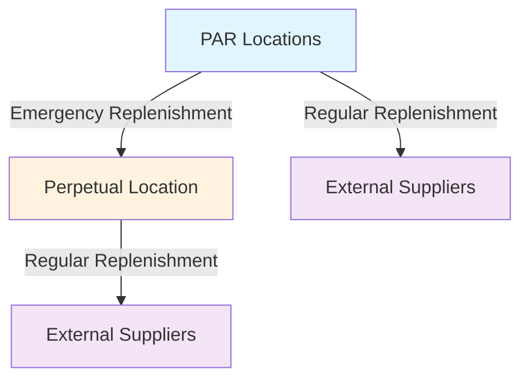

# Cedars-Sinai Marina del Rey Hospital
## Medical Supply Inventory Optimization Project

---

## 🏥 **SLIDE 1: Introduction & Background**

### **Title: Project Introduction - Confidential Core & Cedars-Sinai Partnership**

---

### **Who We Are**
**Confidential Core** is a specialized consulting and simulation engineering firm focused on healthcare operations optimization.

### **Our Partnership**
We have partnered with **Cedars-Sinai Health System** for a strategic pilot project at their new **Marina del Rey hospital facility**.

### **Project Objective**
> **"Use digital twin simulation to optimize medical supply inventory management"**

### **Core Focus Areas**
- ✅ Ensuring optimal medical supplies availability across all PAR locations
- ✅ Eliminating excess inventory waste
- ✅ Minimizing stockouts and emergency replenishment needs
- ✅ Maintaining patient safety through reliable supply chains

---

## 🎯 **SLIDE 2: Problem Statement**

### **Title: The Challenge - Determining Optimal Inventory Targets**

---

### **The Core Problem**
Cedars-Sinai needs to determine optimal inventory levels for their new Marina del Rey hospital:

### **Two Critical Decisions Required**

| **Decision Type** | **What It Means** | **Impact** |
|------------------|-------------------|------------|
| **Cycle Inventory Targets** | PAR levels for each department | Daily operational efficiency |
| **Safety Inventory Targets** | Centralized perpetual location stock | Emergency backup availability |

### **Key Questions We Must Answer**
- 🏥 **How much inventory** should be kept at each PAR location?
- 🏥 **How much safety stock** should be held centrally?
- 🏥 **What are the optimal replenishment cycles?**

### **Critical Insight**
> ⚠️ **These are targets we must SET - not something simulation can recommend automatically**

---

## 🔬 **SLIDE 3: Simulation Overview**

### **Title: Our Simulation Solution - Daily Testing Environment**

---

### **Core Principle**
> **"Simulation on its own cannot RECOMMEND — but it can TEST ANY scenario"**

### **What Our Simulation Tracks**
The model provides **time-series behavior analysis** of:

- 📊 **Inventory levels at each PAR location**
- 📊 **Inventory levels at the perpetual (safety stock) location**
- 📊 **Real-time supply chain dynamics**

### **Three Core Dynamics Modeled**



1. **🔄 PAR Replenishment** - Regular restocking of department locations
2. **🔄 Perpetual Replenishment** - Central safety stock management
3. **🚨 Emergency Replenishment** - PAR-to-perpetual emergency transfers

### **Technical Specifications**
- **Daily simulation capability** - Unique ability to process daily demand patterns and produce daily inventory trajectories
- **SKU-level lead times** modeled for both PAR and perpetual replenishment
- **Real-time inventory tracking** across all locations
- **Demand pattern analysis** and impact assessment

### **Simulation Outputs**
- 📈 **Inventory trajectories** (time series data)
- 📊 **Emergency replenishment counts** and magnitude
- ⚠️ **Full stockout incidents** (even after drawing from perpetual)

---

## 🧪 **SLIDE 4: Pilot Phase - Inventory Testing**

### **Title: Pilot Phase - Verifying Model Internal Consistency**

---

### **Verification Approach**
We tested our simulation using **two conventional analytical methods** for inventory target calculation:

| **Method** | **Application** | **Purpose** |
|------------|----------------|-------------|
| **Safety Stock Formula** | Cycle inventory (PAR levels) | Standard industry approach |
| **Safety Stock Formula** | Safety inventory (perpetual) | Central backup optimization |

### **Verification Framework**
- 📊 **Realistic historical demand data** used for verification
- 🏥 **Hospital-level stockout analysis** performed
- ⚡ **Emergency replenishment tracking** implemented

### **Verification Results Analyzed**
- 📈 **Number of stockouts** across hospital departments
- 🔄 **Emergency replenishment counts** and severity levels
- ⏱️ **Response time effectiveness** of current systems

### **Verification Outcome**
> ✅ **Simulation model internal consistency successfully verified** for healthcare inventory scenarios

### **Next Steps**
> 📋 **Detailed pilot scenario results available in separate technical deck**

---

## 🚀 **SLIDE 5: Expansion Phase - Optimization Engine**

### **Title: Expansion Phase - Simulation as an Optimization Engine**

---

### **Primary Goal**
> **"Optimize and enhance inventory management while reducing inventory holding costs"**

### **Simulation as Input-Output Machine**
The simulation functions as a **daily simulation engine** that:
- **Input**: Daily demand patterns
- **Output**: Inventory levels over time
- **Capability**: Processes daily demand and produces daily inventory trajectories

### **Two Monte Carlo Engines**
The simulation contains **two independent randomness sources**:

| **Engine** | **Purpose** | **Impact** |
|------------|-------------|------------|
| **🎲 Demand Pattern Engine** | Generates different demand scenarios | Affects inventory depletion rates |
| **⏱️ Lead Time Engine** | Simulates varying replenishment cycles | Determines safety stock requirements |

### **Lead Time Optimization Focus**
> **"Lead time is the key factor - longer lead times require more safety stock"**

**Optimization Strategy**: Focus on **reducing lead times** to naturally reduce safety stock requirements

### **Simulation Capabilities**
The simulation now allows us to test **any scenario** by varying three key parameters:

| **Parameter** | **Description** | **Impact** |
|---------------|-----------------|------------|
| **🎯 Inventory Targets** | Cycle and safety stock levels | Supply availability |
| **⏱️ Lead Times** | PAR and perpetual replenishment cycles | Response speed |
| **📊 Demand Patterns** | Daily time series variations | Real-world complexity |

### **Advanced Dynamics Captured**

#### **Demand Pattern Complexity**
> **"Sequential or lumpy demands can deplete inventory faster than averages suggest"**

- 🔄 **Signal-like demand patterns** that create dynamic inventory depletion
- ⚡ **Rapid succession demands** vs. **spaced-out demands**
- 📈 **Real-world variability** that traditional formulas miss

### **Visual System Architecture - Complex PAR-Perpetual Network**

#### **3D Building Visualization - Why Custom Simulation is Essential**
```
┌─────────────────────────────────────────────────────────┐
│  Floor 5: ICU PARs     [SKU A] ←→ [SKU B] ←→ [SKU C]    │
├─────────────────────────────────────────────────────────┤
│  Floor 4: Surgery PARs [SKU A] ←→ [SKU B] ←→ [SKU C]    │
├─────────────────────────────────────────────────────────┤
│  Floor 3: Emergency PARs[SKU A] ←→ [SKU B] ←→ [SKU C]   │
├─────────────────────────────────────────────────────────┤
│  Floor 2: General PARs [SKU A] ←→ [SKU B] ←→ [SKU C]    │
├─────────────────────────────────────────────────────────┤
│  Floor 1: General PARs [SKU A] ←→ [SKU B] ←→ [SKU C]    │
└─────────────────────────────────────────────────────────┘
                              ↕
┌─────────────────────────────────────────────────────────┐
│  Ground Floor: PERPETUAL INVENTORY                      │
│  [SKU A] ● [SKU B] ● [SKU C] ● [SKU D] ● [SKU E]       │
│     ↕       ↕       ↕       ↕       ↕                  │
│  Complex routing network to multiple PARs               │
└─────────────────────────────────────────────────────────┘
```

#### **Three Core Dynamics Modeled**
```
┌─────────────────────────────────────┐
│        PAR REPLENISHMENT CYCLE      │
│         [Lead Time Inside]          │
│  ←─── Demand Signals Input ────     │
└─────────────────┬───────────────────┘
                  │
                  │ Emergency
                  │ Replenishment
                  │ (Vertical Loop)
                  ▼
┌─────────────────────────────────────┐
│      PERPETUAL REPLENISHMENT CYCLE  │
│         [Lead Time Inside]          │
└─────────────────────────────────────┘
```

### **Three Cycle Explanation**
1. **🔄 Top Loop**: PAR replenishment cycle with lead time delays
2. **🔄 Bottom Loop**: Perpetual replenishment cycle with lead time delays  
3. **🔄 Vertical Loop**: Emergency replenishment connecting PAR to perpetual

### **Why This Complexity Matters**
> **"This complex network of PAR-perpetual connections with emergency routing cannot be modeled by generic inventory software"**

- ❌ **Generic tools**: Assume single inventory system
- ❌ **Our reality**: Two independent systems with emergency connections
- ✅ **Our solution**: Custom simulation modeling this exact architecture

### **Scenario Testing Outputs**
For each scenario tested, we receive:

- 📊 **Time-series inventory levels** (PAR and perpetual)
- 🚨 **Emergency replenishment count** and magnitude
- ⚠️ **Stockout count** and severity
- 📈 **Performance metrics** and optimization insights

### **Implementation Benefits**
- 🎯 **Data-driven inventory decisions**
- 📊 **Risk mitigation** through scenario planning
- 💰 **Cost optimization** through precise targeting
- 🏥 **Patient safety** through reliable supply chains

### **Next: Understanding the Technical Framework**
Now that we've established the simulation's capabilities, let's examine the technical parameters and how to use this powerful tool for optimization.

---

## 📊 **SLIDE 6: Simulation Inputs and Outputs**

### **Title: Simulation Inputs & Outputs - Technical Framework**

---

### **Simulation Inputs**
| **Input Type** | **Description** | **Responsibility** |
|----------------|-----------------|-------------------|
| **📊 Daily Demand Pattern** | Time series of daily demand | Nausheen's Team |
| **🎯 Target Levels** | PAR and perpetual inventory targets | Optimization Team |
| **⏱️ Lead Times** | PAR and perpetual replenishment cycles | Operations Team |

### **Simulation Outputs**
- 📈 **Inventory level time series** (both PAR and perpetual)
- 🚨 **Number of stockouts** (consequence of inventory levels)
- 🔄 **Number of emergency replenishments** (consequence of inventory levels)

### **Key Insight**
> **"Once you know inventory levels over time, you automatically know the counts of stockouts and emergency replenishments"**

---

## 🧮 **SLIDE 7: Running Experiments with the Simulation Calculator**

### **Title: Running Experiments - The Simulation Calculator**

---

### **How the Calculator Works**
The simulation functions as a **dynamic calculator** for inventory experimentation:

### **Step-by-Step Process**
1. **🎯 Set Target Levels** - Define cycle inventory and safety inventory targets
2. **📊 Define Scenario** - Input daily demand patterns and lead times  
3. **▶️ Run Simulation** - Execute the model to see inventory dynamics
4. **📈 Analyze Outputs** - Review inventory time series and performance metrics

### **Key Insight**
> **"The simulation cannot guess optimal targets - it can only test what you input"**

### **Calculator Capabilities**
- **Input**: Target levels + daily demand + lead times
- **Output**: Inventory levels over time + stockout/emergency counts
- **Purpose**: Test any scenario to understand inventory behavior

---

## 🔄 **SLIDE 8: Generalized Optimization Algorithm**

### **Title: Optimization Algorithm - Finding Optimal Inventory Targets**

---

### **Optimization Approach**
**Iterative algorithm** that searches for optimal inventory targets:

### **Process Flow**
1. **Start with initial values** based on analytical methods
2. **Set fixed scenario** (specific daily demand + lead times)
3. **Run simulation** to test current targets
4. **Adjust targets** based on results (minimize stockouts)
5. **Repeat** until optimal solution found

### **Key Characteristics**
- **Black box optimization** - treats simulation as complete system
- **Requires full simulation runs** to evaluate objective function
- **Objective**: Minimize stockouts and emergency replenishments
- **Constraint**: Hospital-level stockout elimination

### **Why Simulation is Essential**
> **"Stockout and emergency replenishment metrics only come from dynamic simulation"**

---

## 🎲 **SLIDE 9: Simulation-Based Optimization with Monte Carlo**

### **Title: Monte Carlo Optimization - Handling Real-World Uncertainty**

---

### **The Challenge**
**Single scenario optimization is incomplete** because:
- Demand patterns are not stable in reality
- Lead times vary significantly
- Results are not deterministic

### **Monte Carlo Solution**
**For each target scenario**, run multiple replications:

### **Process**
1. **Define target levels** (cycle + safety inventory)
2. **Run Monte Carlo experiment** varying:
   - Daily demand patterns (distribution)
   - Lead times (distribution)
3. **Calculate expected value** of outcomes
4. **Use expected value** in optimization loop

### **Key Benefits**
- **Probabilistic results** instead of single data points
- **Robust optimization** against uncertainty
- **Realistic scenario coverage** for decision-making

### **Two Monte Carlo Engines**
- **🎲 Demand Pattern Engine** - Different demand scenarios
- **⏱️ Lead Time Engine** - Various replenishment cycles

---

## 🏥 **SLIDE 10: Defining Scenarios with Nausheen's Team**

### **Title: Scenario Creation - Working with Nausheen's Team**

---

### **Three Types of Scenarios**

| **Scenario Type** | **Description** | **Purpose** |
|-------------------|-----------------|-------------|
| **📊 Regular Operations** | Seasonal, routine demand patterns | Baseline testing |
| **🔄 Pattern Variations** | Same demand, different signal shapes | Stress testing |
| **🚨 Disease-Specific** | Patient admission-based scenarios | Emergency preparedness |

### **Revolutionary Approach: Patient-Focused Modeling**

#### **Shift from Demand to Patients**
Instead of forecasting SKU demand directly, **model patient characteristics**:

### **Agent-Based Modeling**
- **Simulate patient admissions** with specific disease profiles
- **Create consumption blueprints** for each patient type
- **Automatically generate demand patterns** from patient scenarios

### **Patient-to-Demand Translation Process**

#### **Step-by-Step Flowchart**
```
Patient Admission → Disease Profile → Consumption Blueprint → SKU Demand Pattern
     ↓                    ↓                    ↓                    ↓
[Patient arrives]  [COVID-19, ICU]  [Timeline template]  [Daily SKU usage]
     ↓                    ↓                    ↓                    ↓
[Admission data]   [Comorbidities]   [Department routing]  [Inventory depletion]
```

#### **Detailed Translation Process**
1. **Patient Characteristics Input**
   - Disease type and severity
   - Comorbidities and complications
   - Expected length of stay
   - Department routing (ER → ICU → General)

2. **Consumption Blueprint Creation**
   - **Lookup function**: Disease-specific consumption templates
   - **Timeline mapping**: What SKUs used when and where
   - **Department-specific usage**: Different consumption per floor
   - **Comorbidity stacking**: Multiple conditions = additive consumption

3. **Timeline Visualization**
```
Day 1: ER Department    [SKU A: 5 units] [SKU B: 2 units] [SKU C: 0 units]
Day 2: ICU Department   [SKU A: 3 units] [SKU B: 8 units] [SKU C: 4 units]  
Day 3: ICU Department   [SKU A: 2 units] [SKU B: 6 units] [SKU C: 3 units]
Day 4: General Floor    [SKU A: 1 unit]  [SKU B: 2 units] [SKU C: 1 unit]
       ↓ Sum all departments = Total daily demand pattern
```

### **Concrete Example**
> **"We can create scenarios for mass shootings, natural disasters, pandemics - and know exactly what SKUs we need"**

### **Machine Learning Project Opportunities**

#### **Primary ML Challenge**
> **"Translate patient characteristics into precise SKU consumption patterns"**

#### **Specific ML Projects**

| **Project** | **Input** | **Output** | **Value** |
|-------------|-----------|------------|-----------|
| **Pattern Recognition** | Patient demographics, disease type, comorbidities | SKU usage timeline | Automated demand generation |
| **Template Creation** | Historical patient data | Disease-specific consumption blueprints | Standardized patient profiles |
| **Comorbidity Stacking** | Multiple conditions per patient | Additive consumption patterns | Complex patient modeling |
| **Timeline Prediction** | Patient admission data | Department-specific usage schedule | Precise demand forecasting |

#### **Technical Implementation**
- **Data Requirements**: Historical patient admission records with SKU consumption
- **Model Type**: Time series prediction with multi-output regression
- **Training Data**: Patient characteristics → SKU usage patterns
- **Validation**: Cross-validation with different disease types

#### **Business Impact**
- **Automated scenario generation** for any patient type
- **Reduced manual template creation** effort
- **More accurate demand forecasting** based on real patient patterns
- **Scalable approach** for new disease types or patient profiles

---

## ⏱️ **SLIDE 11: Working with Lead Times**

### **Title: Lead Time Optimization - The Critical Success Factor**

---

### **Lead Time: The Critical Factor**
> **"Lead time is the single most important value aside from demand"**

### **System Drivers**
- **Demand**: External factor (forecasting responsibility)
- **Lead Time**: Internal + External factors (optimization opportunity)

### **Lead Time Components**

| **Component** | **Control** | **Responsibility** |
|---------------|-------------|-------------------|
| **External Lead Time** | No control | Nausheen's Team (forecasting) |
| **Internal Lead Time** | Full control | Operations Team (optimization) |

### **Optimization Opportunities**

#### **External Factors (Forecasting)**
- **Vendor selection** with different lead times
- **Demand forecasting** accuracy improvements
- **External supply chain** coordination

#### **Internal Factors (Operations)**
- **Internal transportation** efficiency
- **Resource allocation** optimization
- **Process flow** improvements
- **Bottleneck identification** and resolution

### **Key Insight**
> **"The delay in replenishment cycles creates uncertainty and drives safety stock requirements"**

---

## 🎯 **SLIDE 12: Smart Inventory Benefits**

### **Title: Smart Inventory - Final Outcomes & Value Proposition**

---

### **What Makes This Different**
**Unique complexity**: Two independent inventory systems with emergency connections
- **PAR locations**: Independent replenishment cycles
- **Perpetual location**: Centralized safety stock
- **Emergency connections**: Complex routing network between PARs and perpetual

### **Smart Inventory Capabilities**

#### **1. Precise Scenario Testing**
- **Daily demand patterns** with realistic variability
- **Patient admission-based** demand generation
- **Disease-specific** emergency scenarios
- **Targeted preparedness** for known incidents

#### **2. Dual Optimization Approach**

| **Optimization Path** | **Method** | **Outcome** |
|----------------------|------------|-------------|
| **Forecasting Improvement** | Better demand + external lead time forecasts | Reduced inventory levels |
| **Operations Enhancement** | Internal process modeling + efficiency gains | Improved replenishment cycles |

### **Smart Monitoring System**

#### **Design Phase Timeline**
- **Quarterly reviews** with scenario testing
- **Policy lock-in** based on simulation results
- **Production deployment** of optimized inventory levels

#### **Monitoring Phase Timeline**
- **Real-time scenario testing** for new information
- **Emergency response** validation
- **Continuous optimization** based on actual performance

### **Final Outcome**
> **"Tool that carries the least amount of inventory with the least amount of risk - immune against targeted realistic scenarios"**

### **Unique Value Proposition**
> **"This complex PAR-perpetual dynamic with emergency connections cannot be modeled by off-the-shelf software - it requires custom simulation development"**

---

## 📝 **Future Enhancements & Considerations**

### **Missing Practical Details**
- ⏰ **Timeline information**: Project timeline and phases
- 📊 **Success metrics**: Specific KPIs to be measured
- 🚀 **Implementation timeline**: Rollout schedule

### **Missing Business Context**
- ⚠️ **Risk mitigation**: What happens if inventory isn't optimized?
- 💰 **ROI potential**: Cost savings and return on investment
- 🤖 **AI integration**: Agentic AI capabilities for scenario automation
- 🏆 **Innovation advantage**: Competitive positioning

### **Missing Technical Context**
- 📋 **Data requirements**: What data does Cedars-Sinai need to provide?
- 🔗 **Integration needs**: How does this integrate with existing systems?
- 🌐 **Scalability**: Multi-hospital expansion capability

#### **Multi-Hospital Architecture Vision**
```
    Hospital A PARs ──┐
    Hospital B PARs ──┼── Central Perpetual Hub
    Hospital C PARs ──┘
         (Star-shaped network)
```
- ✅ **Simultaneous operation**: All hospitals can run scenarios concurrently
- ✅ **Centralized management**: Single perpetual location serves multiple facilities
- ✅ **Scalable design**: Easy addition of new hospital locations

---

*Confidential Core - Healthcare Operations Optimization*
